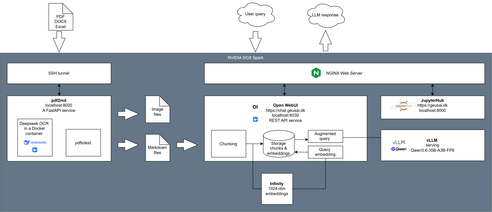

# Scientific Friday Bar #1
**Event summary - [GEUS](https://www.geus.dk/), Friday 18 September 2026**

*By Nikolai Andrianov, GEUS - organizer and speaker (nikolai@scifbar.dk). Reviewed by the participants.*

## About

[Scientific Friday Bar](https://scifbar.dk/) is a recurring, informal session where people discuss real AI use cases. Each session is hosted by one organization, a company or a research institution, on its own premises, so the discussion stays close to the host's actual work and data. The host presents one concrete case: a working AI workflow that needs scrutiny, or a problem still looking for a solution. The room brings together the host's technical and domain staff with external data scientists. The host provides the venue and the drinks; attending is free. Sessions are capped at around 20 participants, invited from the registration pool.

## This session's host
- Geological Survey of Denmark and Greenland ([GEUS](https://www.geus.dk/))
- A research institute within the [Danish Ministry of Climate, Energy and Utilities](https://www.kefm.dk/)
- Exploitation and protection of geological resources
- Mapping, compilation and storage of data, research, monitoring and consultancy within water, energy, minerals, climate and environment
- About 200 scientists in Copenhagen, Aarhus and Nuuk

## Who was in the room

| Participant category | Number |
|---|---|
| Data scientist | 6 |
| Host management | 2 |
| Host domain expert | 2 |
| Other organization / potential host | 2 |
| Organizer and speaker | 1 |
| **TOTAL** | **13** |

## What came out of it

The [talk](#the-talk-local-ai-for-confidential-subsurface-data) presented a local LLM stack built for two GEUS workflows: reading sedimentary facies from gamma-ray logs, and mining scanned expedition reports for mineral exploration. The discussion afterwards boiled down to the following five items worth trying. 

1. **Put a harness around the model instead of improving retrieval.** In both workflows the wrong chunks get retrieved because a geologist's question and the wording of a report or a facies description rarely match. The gain today comes from a layer where one model plans the search and another checks the answer against the sources, not from a better vector database. Starting points: [awesome-harness-engineering](https://github.com/ai-boost/awesome-harness-engineering) and open-source agentic frameworks such as [OpenCode](https://opencode.ai/). Difficulty: medium.

2. **Run an agentic coding tool directly over the corpus first.** Point OpenCode or similar at the markdown files and let it search and read them, then compare its answers with the current pipeline on the same questions. A day's work, and it shows how much of the pipeline is actually needed before anything gets rebuilt.

3. **Decide what a correct answer is, and check for it.** The pipeline cannot distinguish a right answer from a wrong one. A small answer key per workflow would fix that: log intervals with a sedimentologist's facies labels, and reports with known mineral mentions. With the key in place every answer can be checked against its sources, and the accuracy of the workflow, which is not measured today, becomes a number. The key is quick to build; wiring the check into the pipeline takes longer. A task is worth automating only if it is fast, verifiable and repeated ([Karpathy](https://karpathy.bearblog.dev/verifiability/)).

4. **Let deterministic code handle the numbers.** Depth intervals, coordinates, chemical analysis tables and unit conversions are what a language model does worst and a parser does perfectly. Keep the model for language and orchestration, and go through both workflows to list every place where a generative model currently does a job a deterministic one should. A short audit, then fixes item by item.

5. **Try a feedback loop on the facies reading.** Where plain prompting gives poor results, feeding the failure back into the next attempt, with retrieval and possibly fine-tuning in the loop, raises the chance of a correct answer with each pass. The result stays probabilistic. One participant's [study](https://link.springer.com/chapter/10.1007/978-3-032-36590-3_15) ([preprint](https://arxiv.org/abs/2605.13896)) shows the pattern for code translation; gamma-ray-to-facies is the same kind of niche task. The biggest of the five.

## The talk: Local AI for confidential subsurface data

The slides are available as a [PDF](https://github.com/scifbar/events/blob/main/2026-09-geus/scifbar_20260918_geus_slides.pdf).

Nikolai Andrianov (GEUS) presented the hardware and software stack built for two research projects:
- Optimized Monitoring of Ground- and surface-water for Carbon Capture and Storage ([OMGCCS](https://omgccs.dk)), funded through [INNO-CCUS](https://inno-ccus.dk/);
- Exploring AI for Data Mining and Knowledge Extraction, funded through the Ministry of Mineral Resources of Greenland.

The goal of the OMGCCS project is to design a monitoring program that can detect and quantify potential CO2 leaks from the deep subsurface all the way up to the groundwater and to surface waters such as rivers and lakes. For the specific case onshore Denmark (the Havnsø area), the planned CO2 injection will be at about 1500 m below the surface, while the drinking-water aquifers reach down to about 200 m.

One of the first tasks in OMGCCS is to build a geological model of the interval between the storage formation and the surface. The problem is that there is very little data for the depths between about 200 m and 1500 m. In fact, there are only gamma-ray logs from a handful of wells at the edge of the area of interest, no core, and the general knowledge of the sedimentology and geological history of this part of Denmark. This is not sufficient for a traditional geological modelling workflow, so a team at GEUS is investigating whether a sedimentologist's textual facies descriptions can be correlated with the gamma-ray signatures of the corresponding intervals, and whether an LLM can do that reading.

The data mining project is concerned with identifying relevant information in hundreds to thousands of scanned PDF reports documenting Greenlandic expeditions from the mid-20th century to the present. The reports, written in for example English, Danish or German, contain textual descriptions of geological evidence for minerals of interest. The goal of the project is to extract this data from the reports, augment it with data from databases (for example chemical analyses), and draw conclusions for prospective mineral exploration.

While the scope of work in the two projects is very different, both require the means to analyze large amounts of textual information, which is exactly the realm of Large Language Models (LLMs).

An important prerequisite for working with geological data is that much of it is confidential. This limits the use of cloud-based LLMs and calls for local AI models.

Everything shown on screen at the session came from public sources, apart from statistics computed on well logs that are themselves partner-confidential, as is a large part of the GEUS subsurface archive. The stack is therefore built local from day one, so that the same workflow can take confidential data without any change.

After evaluating several options, the stack presented in the talk runs a Qwen3.6 model on an NVIDIA DGX Spark:

The workflow has two distinct modes:
- **Data ingestion** runs from a user's laptop through an SSH tunnel to the DGX. Once the source files are uploaded, the text is extracted from the PDFs by the pdf2md service, either with DeepSeek-OCR (for scanned reports) or with a deterministic pdftotext-based engine (for digital-native PDFs); Word and Excel files are converted directly. The resulting markdown texts are chunked (900 tokens per chunk, 100 tokens overlap), embedded with the BAAI/bge-m3 model, and stored in the vector database of the Open WebUI platform.
- **Inference** is triggered by a user prompt, which reaches the DGX through an nginx web server. Following the traditional RAG (Retrieval-Augmented Generation) approach, the 10 chunks closest to the query in the embedding space are retrieved, and the augmented prompt is fed to the local Qwen3.6-35B-A3B-FP8 model served by vLLM. This yields a comfortable rate of about 50 tokens per second; humans read at 5 to 7 tokens per second.

The key to the good Qwen performance on the DGX is that its Mixture-of-Experts (MoE) architecture fits the DGX hardware well. In Qwen3.6-35B-A3B-FP8, only about 3B *active* parameters out of the 35B total are used for each generated token (which experts are active changes from token to token). This matches the main limitation of the DGX: the bandwidth of about 270 GB/s between the 128 GB unified memory and the GPU. Fewer active bytes per token means more tokens per second. FP8 quantization (one byte per parameter instead of two) adds to that:

| Model | Total parameters | Active bytes per token | Generation speed |
|---|---|---|---|
| Gemma-3-27B (INT4 weights) | 27B | ~14 GB | ~12 tok/s |
| Qwen3.6-35B-A3B-FP8 | 35B (3B active) | ~3 GB | ~50 tok/s |

## Feedback from the room

In the lively discussion that followed the talk, the participants made the following points about the workflow. The numbers in brackets refer to the actions listed above.

1. The presented RAG pipeline was state of the art two years ago, and most companies invested in exactly this two to three years ago. Since then the quality of LLM output has improved considerably, and the investment has moved to the harness around the model calls. Two distinct layers hide under that one word. The orchestration harness is the agentic system that plans and routes the calls, several models working the problem together; this is largely how Anthropic succeeds, and [OpenCode](https://opencode.ai/) is the open-source alternative. The eval harness is a separate concern: does the answer actually follow from the retrieved sources and address the question asked, and, upstream of that, did the retrieval step itself surface the right material in the first place, which is rarely checked. Naive RAG, simple chunking followed by vector matching, is error-prone because of the semantic gap between a query and the indexed text. For the local stack this means an upgraded orchestration layer with multi-model planning and verification on top of the vector database, plus an eval harness that scores both retrieval and answer quality, not a better vector database. A curated overview of the orchestration side is kept at [awesome-harness-engineering](https://github.com/ai-boost/awesome-harness-engineering). Running an agentic tool directly over the corpus is also the cheapest way to see how much the current pipeline actually contributes. (Actions 1 and 2.)

2. Any AI workflow needs explicit verification steps. A task should only be automated if it is fast, verifiable and repeated, following [Karpathy's verifiability argument](https://karpathy.bearblog.dev/verifiability/): classical software automates what can be specified, LLMs automate what can be verified. The current pipeline has no such step, so a verification mechanism is what would make it trustworthy. (Action 3.)

3. Generative AI is often applied to tasks it is not designed for, such as precise numerical processing or structured data extraction, where deterministic tools are superior. The LLM should be used for natural-language interfacing and orchestration only, with all number crunching and structural extraction routed to deterministic software, which avoids hallucinations where 100% precision is required. The first step is fixing data quality and picking the right non-generative tool; the second is an audit of the use cases to find where a generative model is doing a job that a deterministic one should do. (Action 4.)

4. For complex proprietary tasks, code translation was the example, plain prompting fails. What works is a hybrid of fine-tuning, retrieval loops with error feedback, and iterative correction. Such loops do not guarantee correctness; they raise the probability of a correct result by feeding the failure context back into the next attempt, and the outcome stays probabilistic. One participant's [study with a student](https://link.springer.com/chapter/10.1007/978-3-032-36590-3_15) ([preprint](https://arxiv.org/abs/2605.13896)) documents this for code translation. The same kind of adaptive feedback loop, and possibly fine-tuning, would be needed for niche geological tasks where standard prompting gives poor results. (Action 5.)

## Also at the bar

- **Calibrated uncertainty.** AI systems should output calibrated probabilities rather than bare predictions; a softmax score is not a confidence. Calibrated confidence would let a system route its low-confidence outputs to a check or to a human and improve from there, but estimating true confidence costs compute or architectural changes. A purpose-built alternative already exists for classification-style decisions: Jev-type models, non-autoregressive "System 1" classifiers trained with strictly proper scoring rules to return calibrated probability distributions directly instead of generating text, such as [Laya](https://huggingface.co/convaiinnovations/laya), an open-weight, self-hostable model built as a drop-in replacement for the proprietary TypeSafe Jev API. More broadly, the AI industry should adopt the scientific standards for uncertainty quantification that machine-learning research already applies at conferences such as NeurIPS: transparent error margins instead of black-box outputs. That is a cultural shift in how models are deployed and evaluated, not a technical one. A survey of uncertainty estimation techniques for LLMs: [arXiv 2503.00172](https://arxiv.org/abs/2503.00172).

- Relevant upcoming meetings:
    - [Digital Tech Summit](https://event.ing.dk/dts6)
    - [D3A conference](https://d3aconference.dk/)

*This session was a dissemination activity of the OMGCCS project, funded by INNO-CCUS.*
